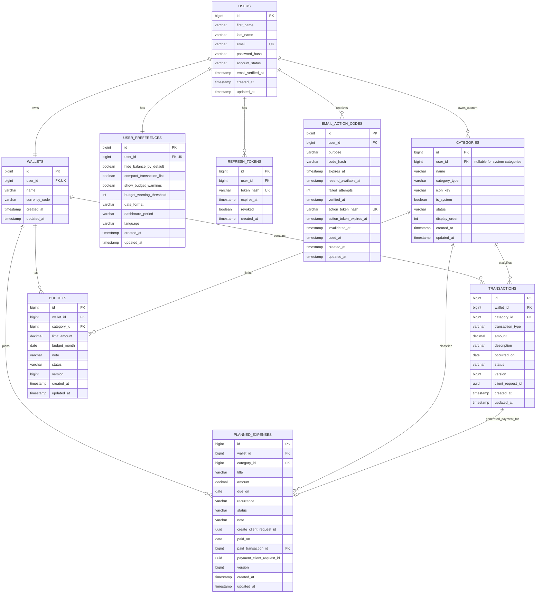

# SmartWallet ERD v3 — Planning

This ERD represents the persisted database schema after Flyway migrations V1-V7.

Safe to Spend and Weekly Insights are intentionally excluded as entities because they are calculated by the backend from persisted financial data.

## Key Constraints

- one wallet per user
- one preference row per user
- category type is `INCOME` or `EXPENSE`
- system categories have no owner; custom categories belong to a user
- transaction amount is positive
- transaction status is `ACTIVE` or `ARCHIVED`
- active transaction create request ids are wallet-scoped for idempotency
- active budget uniqueness is wallet + category + month
- budget month is the first day of its month
- budget status is `ACTIVE` or `ARCHIVED`
- planned amount is positive
- planned recurrence is `NONE`, `WEEKLY`, `MONTHLY` or `YEARLY`
- planned status is `UPCOMING`, `PAID`, `CANCELLED` or `ARCHIVED`
- a `PAID` planned expense must have `paid_on`, `paid_transaction_id` and `payment_client_request_id`
- planned create/payment request ids are wallet-scoped for idempotency

## Calculated Values

Not stored as tables/columns:

- wallet balance
- budget spent / remaining / progress
- Safe to Spend
- Weekly Insights
- upcoming counts/totals
